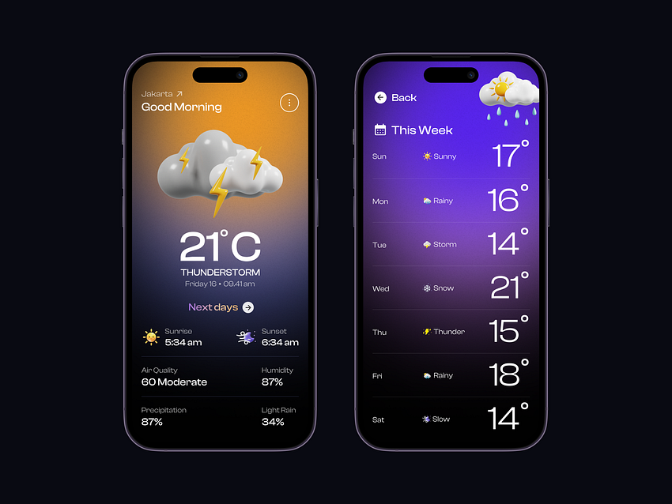

# **Weather App**

[](LICENSE)
[](https://github.com/your-username/repository-name/releases)




## 📱 **App Overview**

**Weather App** is a mobile application built with Flutter that provides users with accurate, location-based weather updates by fetching data from the **OpenWeather API**. The app leverages the device’s GPS to retrieve the user’s current location and display real-time weather data on the UI. It uses the **Bloc** pattern for state management to ensure a responsive and efficient app experience.

## ✨ **Features**

- 🌍 **Location-Based Weather** – Automatically fetches and displays weather data based on the user's current location.
- 🌤️ **Weather Data** – Shows key weather information such as temperature, humidity, wind speed, and more.
- 🌡️ **Temperature Units** – Toggle between Celsius and Fahrenheit.
- 📅 **Localized Date and Time** – Displays the current date and time in the user’s preferred format.
- 🔄 **State Management** – Uses the Bloc pattern to efficiently manage the app's state.

## 🛠 **Technologies Used**

- **Dart & Flutter** – For building the app’s user interface and managing app logic.
- **OpenWeather API** – To retrieve live weather data for any location.
- **Geolocator** – To get the user’s current GPS location.
- **Weather** – A package for easier interaction with the OpenWeather API.
- **Intl** – For internationalization and localization of date and time formats.
- **Flutter_Bloc** – For state management using the Bloc pattern.
- **Equatable** – To simplify value comparison in Dart objects, used with `flutter_bloc`.

## 🚀 **Getting Started**

### **Prerequisites**

- Flutter SDK: [Install Flutter](https://flutter.dev/docs/get-started/install)
- Dart 2.x or later
- OpenWeather API key (You can get one [here](https://openweathermap.org/api))

### **Installation**

1. Clone the repository:

   ```bash
   git clone https://github.com/dine-issam/Weather-App.git
   ```

2. Navigate into the project directory:

   ```bash
   cd Weather-App
   ```

3. Install the required dependencies:

   ```bash
   flutter pub get
   ```

4. Run the app:

   ```bash
   flutter run
   ```

### **APIs and Keys**

1. Sign up for an API key at [OpenWeather](https://openweathermap.org/api).
2. Add the API key to your project, either in the code or through environment variables (if applicable).

## 🤝 **Contributing**

We welcome contributions! If you would like to contribute, feel free to fork the repository and submit a pull request.

## 📝 **License**

This project is licensed under the MIT License – see the [LICENSE](LICENSE) file for details.

## Contact

For any questions or feedback, feel free to reach out to me on [LinkedIn](https://linktr.ee/DineIssam).
